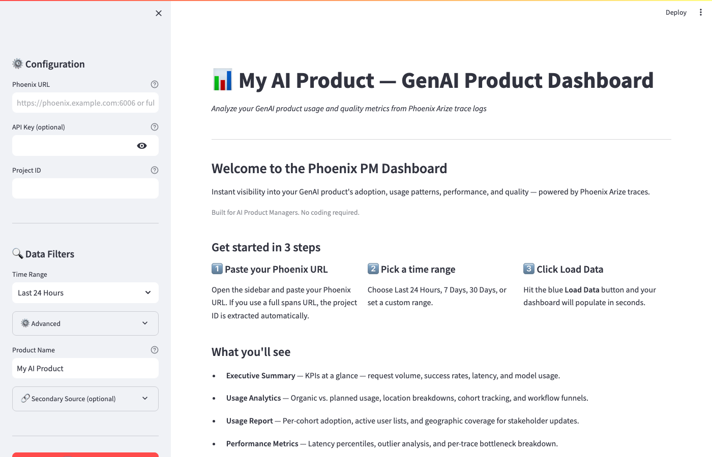
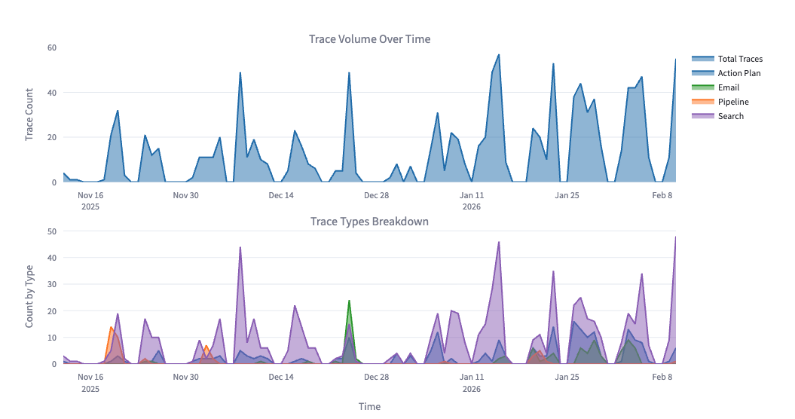
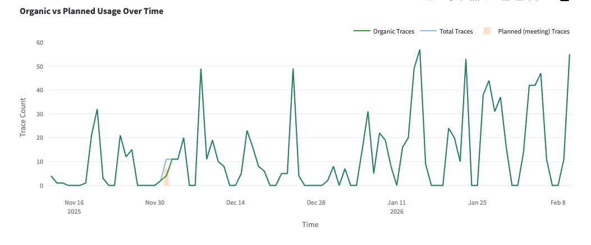

# Phoenix PM Dashboard

**The analytics dashboard for AI Product Managers who need to understand how their GenAI product is actually being used.**

Connect to any [Phoenix Arize](https://phoenix.arize.com/) instance, paste the URL, and get instant visibility into adoption, usage patterns, performance, and quality — no coding or configuration required.



---

## Quick Start

```bash
# 1. Install
pip install -r requirements.txt

# 2. Run
streamlit run dashboard.py

# 3. Paste your Phoenix URL in the sidebar and click "Load Data"
```

That's it. No config files, no environment variables, no database setup.

---

## What You'll See

### Executive Summary
High-level KPIs for leadership: request volume, success rates, latency, token usage, and model distribution at a glance.

### Usage Analytics
Understand *how* people are using your product: organic vs. planned usage, per-location breakdowns, cohort adoption tracking, and workflow completion funnels.





### Usage Report
Per-cohort adoption rates, active and inactive user lists, resource category demand, and geographic coverage — ready to drop into a stakeholder update.

### Performance Metrics
Latency percentiles over time, tail latency analysis, per-trace-type bottleneck breakdown, and slowest-user identification so you know where to push engineering.

### Log Explorer
A downloadable trace list with latency vs. token correlation and span-level step breakdowns. Find the exact request that caused an issue.

### Advanced Analytics
Query pattern intelligence, resource effectiveness scoring, user journey analysis, and drop-off detection to surface product improvement opportunities.

---

## Configuration

**Phoenix PM Dashboard is zero-config by default.** Every feature that only needs trace data works the moment you paste a URL. Features that require extra context (cohorts, meeting schedules, locations) have inline UI inputs right in the dashboard — no file editing needed.

### Optional: `config.yaml`

If you want to pre-populate the UI inputs (useful when you reload the dashboard often), create a `config.yaml` alongside the app. See `config.example.yaml` for the full schema.

| Section | What it pre-fills |
|---------|-------------------|
| `product` | Product name displayed in the header |
| `excluded_users` | Emails and domain patterns filtered from all analytics |
| `trace_types` | Regex patterns that classify root span names into trace types |
| `cohorts` | Named user groups for adoption tracking (e.g., pilot waves) |
| `locations` | Domain-based grouping for location breakdowns |
| `meeting_windows` | Scheduled sessions excluded from organic usage counts |
| `geographic` | Service area zip codes and city name mappings |
| `categories` | Keyword-based query classification rules |

### Environment Variables

| Variable | Required | Description |
|----------|----------|-------------|
| `PHOENIX_API_URL` | No | Default Phoenix URL (overridden by sidebar input) |
| `PHOENIX_API_KEY` | No | API key if your Phoenix instance requires auth |

---

## For Developers

The dashboard is designed to be extended without touching core logic:

- **Add trace types** — define regex patterns in `config.yaml` under `trace_types`, or type them into the UI
- **Add cohorts** — list user emails under `cohorts` in config, or paste them in the Usage Report tab
- **Add query categories** — add keyword lists under `categories` in config
- **Add locations** — map domain patterns to location names under `locations`

### Project Structure

```
phoenix-pm-dashboard/
├── dashboard.py          # Streamlit UI (main entry point)
├── data_analyzer.py      # Trace analysis engine
├── phoenix_client.py     # Phoenix GraphQL API client
├── config.py             # Config loader and helpers
├── config.example.yaml   # Example configuration
├── requirements.txt
└── README.md
```

---

## Requirements

- Python 3.9+
- Access to a Phoenix Arize instance
